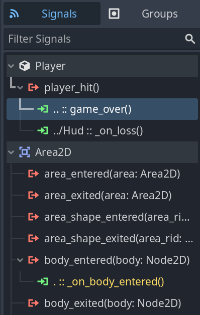
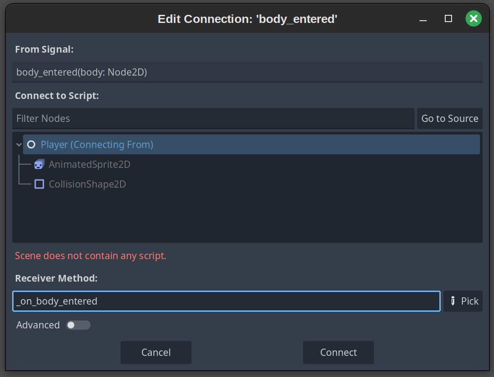

# Attempt to get J-Dax's Godot 4.3 Your First 2D Game C++ code working within Godot 4.5

(A work in progress)

Practically all of the code in this repository comes from one of the following sources:


## Guide to completing the Your First 2D Game (YF2DG) project with C++ Code

(Also a work in progress!)

Note: this document, along with almost practically all of the code in this repository, is based heavily on: 

1. [J-Dax's C++ code for Version 4.3 of the YF2DG project](https://github.com/j-dax/gd-cpp) (released under the BSD-3 license)

1. [The official YFD2G guide for Godot 4.5](https://docs.godotengine.org/en/4.5/getting_started/first_2d_game/index.html)

1. The [Getting started](https://docs.godotengine.org/en/4.5/tutorials/scripting/cpp/gdextension_cpp_example.html) page within Godot's godot-cpp documentation.

1. [Version 3.5 of the YF2DG project](https://docs.godotengine.org/en/3.5/getting_started/first_2d_game/03.coding_the_player.html). (This was the most recent version of the 'Your First 2D Game documentation' to include C++ code examples.)

1. The [godot-cpp-template](https://github.com/godotengine/godot-cpp-template?tab=Unlicense-1-ov-file#readme) repository


## Steps:

1. If you haven't already, make sure you have a compiled copy of the godot-cpp repository project on your computer. ([This guide](https://docs.godotengine.org/en/4.5/tutorials/scripting/cpp/gdextension_cpp_example.html), which I strongly recommend completing before you tackle the YF2DG project, will teach you how to do so.)

1. Follow the steps in the [official YFD2G guide for Godot 4.5](https://docs.godotengine.org/en/4.5/getting_started/first_2d_game/index.html) guide until you reach the 'Coding the player' section.

    Note: Based on J-Dax's guide, I'm storing my Godot Project documents within a 'project' folder inside my main folder. Here's what my folder structure looks like at this point:

        cpp_yf2dg/
        ----project/    
    
1. Once you get to the [Coding the player](https://docs.godotengine.org/en/4.5/getting_started/first_2d_game/03.coding_the_player.html) page, you'll be able to begin adding C++ to your game!

1. **Coding the player section**

    First, copy your compiled godot-cpp folder into your root folder. [Since this folder was around 196 MB in size, I imagine there's a way to avoid directly copying it--but this approach will work for now.] Also add a src/ folder. Your directory should now have the following structure:

        cpp_yf2dg/
        ----project/    
        ----godot-cpp/
        ----src/

    Next, within your src/ folder, add three subfolders: entity/, registry/, and scene/.

    While the official guide discusses attaching a script to your player, this step doesn't apply to C++ code, so you can skip it.
    
1. After the text "Start by declaring the member variables this object will need" within this section, add the following C++ code to /src/entity/player.h:

    (Source: J-Dax's player.h file)

    ```
    #pragma once

    #include <godot_cpp/classes/area2d.hpp>

    using namespace godot;

    class Player : public Area2D {
        GDCLASS(Player, Area2D)

    private:
        int speed;
        Size2 screen_size;

        static void _bind_methods();
    public:
        Player();
        ~Player() = default;

        void start(Vector2 position);

        // signals
        void set_speed(const int);
        int get_speed() const;
        //void _on_body_entered(Node2D *node);

        // engine binding
        void _ready() override;
        void _process(double) override;
    };

    ```

    This code has a number of similarities to the C++ code within [Version 3.5 of the YF2DG project](https://docs.godotengine.org/en/3.5/getting_started/first_2d_game/03.coding_the_player.html).


1. Next, after the "The _ready() function is called when a node enters the scene tree, which is a good time to find the size of the game window" text, add the following code to /src/entity/player.cpp:

    (Source: J-Dax's player.cpp file)

    ```
    #include "player.h"

    #include <godot_cpp/classes/animated_sprite2d.hpp>
    #include <godot_cpp/classes/collision_shape2d.hpp>
    #include <godot_cpp/classes/input.hpp>
    #include <godot_cpp/classes/input_map.hpp>
    #include <godot_cpp/variant/utility_functions.hpp>

    using namespace godot;

    void Player::_ready() {
        // https://github.com/godotengine/godot/issues/74993
        // workaround available: in _ready
        auto im = InputMap::get_singleton();
        im->load_from_project_settings();

        screen_size = get_viewport_rect().size;
    }
    ```

    (This is only a small portion of J-Dax's full Player.cpp file. I simply included the code that was equivalent to the C++ snippet found at this point within the 3.5 tutorial.)


1. After you get to "You can detect whether a key is pressed using Input.is_action_pressed(), which returns true if it's pressed or false if it isn't.", add the following C++ code right below the `Player::_ready()` function:

    (Source: J-Dax's player.cpp file)

    ```
    void Player::_process(double delta) {
        auto input = Input::get_singleton();
        auto velocity = Vector2(0, 0);
        if (input->is_action_pressed("move_up")) {
            velocity.y -= 1;
        }
        if (input->is_action_pressed("move_down")) {
            velocity.y += 1;
        }
        if (input->is_action_pressed("move_left")) {
            velocity.x -= 1;
        }
        if (input->is_action_pressed("move_right")) {
            velocity.x += 1;
        }

        auto animated_sprite_2d = Node::get_node<AnimatedSprite2D>(
            "AnimatedSprite2D");
        if (velocity.x != 0) {
            animated_sprite_2d->set_animation("walk");
            animated_sprite_2d->set_flip_v(false);
            animated_sprite_2d->set_flip_h(velocity.x < 0);
        } else if (velocity.y != 0) {
            animated_sprite_2d->set_animation("up");
            animated_sprite_2d->set_flip_v(velocity.y > 0);
        }

        if (velocity.length() > 0) {
            velocity = velocity.normalized() * speed;
            animated_sprite_2d->play();
        } else {
            animated_sprite_2d->stop();
        }
    ```

1. In addition, add the following code right below `using namespace godot;` so that Godot can make sense of our `speed` variable:

    (Source: J-Dax's player.cpp file)

    ```
    void Player::_bind_methods() {
        // expose speed in the editor
        ClassDB::bind_method(D_METHOD("get_speed"), &Player::get_speed);
        ClassDB::bind_method(D_METHOD("set_speed", "speed"), &Player::set_speed);
        ADD_PROPERTY(PropertyInfo(Variant::INT, "speed"), "set_speed", "get_speed");
    }

    Player::Player() {
        speed = 400;
    }

    void Player::set_speed(const int pSpeed) {
        speed = pSpeed;
    }

    int Player::get_speed() const {
        return speed;
    }

    ```


1. Once you get to the "Add the following to the bottom of the _process function (make sure it's not indented under the else):" text box, add the following before the end of your `_process()` function:

    (Source: J-Dax's player.cpp file)

    ```
    auto new_position = get_position();
    new_position += velocity * delta;

    new_position.x = Math::clamp(new_position.x, 0.0f, screen_size.x);
    new_position.y = Math::clamp(new_position.y, 0.0f, screen_size.y);

    set_position(new_position);
    ```

1. This will also be a good time to fill in the registry/folder. First, save the following file as /src/registry/register_types.h:

    (Source: https://docs.godotengine.org/en/4.5/tutorials/scripting/cpp/gdextension_cpp_example.html)

    Note that the name of the function that returns GDE_EXPORT (in this case, example_library_init) will need to match the name of your entry_symbol value within a .gdextension document that you'll create later on.


    ```
    #pragma once

    #include <godot_cpp/core/class_db.hpp>

    using namespace godot;

    void initialize_example_module(ModuleInitializationLevel p_level);
    void uninitialize_example_module(ModuleInitializationLevel p_level);
    ```

    Next, save the following file as /src/registry/register_types.cpp:

    (Source: https://docs.godotengine.org/en/4.5/tutorials/scripting/cpp/gdextension_cpp_example.html)

    ```
    #include "register_types.h"

    #include "entity/player.h"

    #include <gdextension_interface.h>
    #include <godot_cpp/core/defs.hpp>
    #include <godot_cpp/godot.hpp>

    using namespace godot;

    void initialize_example_module(ModuleInitializationLevel p_level) {
        if (p_level != MODULE_INITIALIZATION_LEVEL_SCENE) {
            return;
        }

        GDREGISTER_RUNTIME_CLASS(Player);
    }

    void uninitialize_example_module(ModuleInitializationLevel p_level) {
        if (p_level != MODULE_INITIALIZATION_LEVEL_SCENE) {
            return;
        }
    }

    extern "C" {
    // Initialization.
    GDExtensionBool GDE_EXPORT example_library_init(
    GDExtensionInterfaceGetProcAddress p_get_proc_address, 
    const GDExtensionClassLibraryPtr p_library, 
    GDExtensionInitialization *r_initialization) {
        godot::GDExtensionBinding::InitObject init_obj(
            p_get_proc_address, p_library, r_initialization);

        init_obj.register_initializer(initialize_example_module);
        init_obj.register_terminator(uninitialize_example_module);
        init_obj.set_minimum_library_initialization_level(
            MODULE_INITIALIZATION_LEVEL_SCENE);

        return init_obj.init();
    }
    }
    ```

1. Next, add the following code within your root folder (i.e. at the same level as your /src, /project, and /godot-cpp folders) to a file named SConstruct (no extension):

    (Source: Downloadable SConstruct file within https://docs.godotengine.org/en/4.5/tutorials/scripting/cpp/gdextension_cpp_example.html )

    Note that, because our C++ files are all located within subfolders, we'll use Glob("src/**/*.cpp") as our `sources` value rather than Glob("src/*.cpp").

    ```
    #!/usr/bin/env python
    import os
    import sys

    env = SConscript("godot-cpp/SConstruct")

    # For reference:
    # - CCFLAGS are compilation flags shared between C and C++
    # - CFLAGS are for C-specific compilation flags
    # - CXXFLAGS are for C++-specific compilation flags
    # - CPPFLAGS are for pre-processor flags
    # - CPPDEFINES are for pre-processor defines
    # - LINKFLAGS are for linking flags

    # tweak this if you want to use different folders, or more folders, to store your source code in.
    env.Append(CPPPATH=["src/"])
    sources = Glob("src/**/*.cpp")

    if env["platform"] == "macos":
        library = env.SharedLibrary(
            "project/bin/libexample.{}.{}.framework/libexample.{}.{}".format(
                env["platform"], env["target"], env["platform"], env["target"]
            ),
            source=sources,
        )
    elif env["platform"] == "ios":
        if env["ios_simulator"]:
            library = env.StaticLibrary(
                "project/bin/libexample.{}.{}.simulator.a".format(env["platform"], env["target"]),
                source=sources,
            )
        else:
            library = env.StaticLibrary(
                "project/bin/libexample.{}.{}.a".format(env["platform"], env["target"]),
                source=sources,
            )
    else:
        library = env.SharedLibrary(
            "project/bin/libexample{}{}".format(env["suffix"], env["SHLIBSUFFIX"]),
            source=sources,
        )

    Default(library)

    ```

1. Open a terminal; navigate to your root folder (i.e. the one that contains your 'godot-cpp', 'src', and 'project' folders); and run `scons platform=linux` (replacing the OS with your own OS as needed).

1. Navigate to your new /project/bin folder; create a new file named gdexample.gdextension; and then add the following code to it:

    (Source: https://docs.godotengine.org/en/4.5/tutorials/scripting/cpp/gdextension_cpp_example.html#id4)

    Note: The original `libgdexample` values were changed to `libexample` so as to match the filename patterns in our SConstruct script.

    ```
    [configuration]

    entry_symbol = "gdextension_init"
    compatibility_minimum = "4.5"
    reloadable = true

    [libraries]

    macos.debug = "res://bin/libexample.macos.template_debug.framework"
    macos.release = "res://bin/libexample.macos.template_release.framework"
    ios.debug = "res://bin/libexample.ios.template_debug.xcframework"
    ios.release = "res://bin/libexample.ios.template_release.xcframework"
    windows.debug.x86_32 = "res://bin/libexample.windows.template_debug.x86_32.dll"
    windows.release.x86_32 = "res://bin/libexample.windows.template_release.x86_32.dll"
    windows.debug.x86_64 = "res://bin/libexample.windows.template_debug.x86_64.dll"
    windows.release.x86_64 = "res://bin/libexample.windows.template_release.x86_64.dll"
    linux.debug.x86_64 = "res://bin/libexample.linux.template_debug.x86_64.so"
    linux.release.x86_64 = "res://bin/libexample.linux.template_release.x86_64.so"
    linux.debug.arm64 = "res://bin/libexample.linux.template_debug.arm64.so"
    linux.release.arm64 = "res://bin/libexample.linux.template_release.arm64.so"
    linux.debug.rv64 = "res://bin/libexample.linux.template_debug.rv64.so"
    linux.release.rv64 = "res://bin/libexample.linux.template_release.rv64.so"
    android.debug.x86_64 = "res://bin/libexample.android.template_debug.x86_64.so"
    android.release.x86_64 = "res://bin/libexample.android.template_release.x86_64.so"
    android.debug.arm64 = "res://bin/libexample.android.template_debug.arm64.so"
    android.release.arm64 = "res://bin/libexample.android.template_release.arm64.so"

    [dependencies]
    ios.debug = {
        "res://bin/libgodot-cpp.ios.template_debug.xcframework": ""
    }
    ios.release = {
        "res://bin/libgodot-cpp.ios.template_release.xcframework": ""
    }

    ```

1. Go back into the Godot editor. (You may need to exit out of it and reload it if it was already open.) Click on your existing Player node; choose 'Change type'; search for 'Player'; and then click Change. This will replace your Area2D node with your C++-based Player class.

    (Alternatively, you could probably have added a new Player node to your scene, *then* completed all of the Player setup tasks described earlier in the Your First 2D Game documentation.)

1. Hit play on the top right to test out the scene. You should be able to move the player around with your keyboard.

1. When you get to the first code block within the 'Choosing animations' section of the 'Coding the player' documentation, go to the following line within your player.cpp code:

    ```
    auto animated_sprite_2d = Node::get_node<AnimatedSprite2D>(
            "AnimatedSprite2D");
    ```

    Next, add the following code directly below this line:

    ```       
        if (velocity.x != 0) {
            animated_sprite_2d->set_animation("walk");
            animated_sprite_2d->set_flip_v(false);
            animated_sprite_2d->set_flip_h(velocity.x < 0);
        } else if (velocity.y != 0) {
            animated_sprite_2d->set_animation("up");
            animated_sprite_2d->set_flip_v(velocity.y > 0);
        }
    ```

1. Rerun `scons platform=(your_os)` within your terminal. (On Linux, and possibly other operating systems also, you can quickly do so by pressing Up Arrow on your keyboard followed by Enter--assuming that this was your most recent command.) Next, play the scene within Godot to confirm that the player's direction and animations now align better than they did previously. 


1. Next, when you get to the last code block within the 'Choosing animations' section, add the following to the end of your `void Player::_ready()` function within player.cpp:

    ```
    // You may find it helpful to comment out the following line
    // at times for debugging/testing purposes, especially 
    // earlier in the tutorial.
    hide();
    ```

    (The player will no longer be visible, as we'll want the player only appear after the completion of a countdown that we'll add in later on.)

1. For the first code block within the 'Preparing for collisions' section, add the following code to the bottom of your `Player::_bind_methods()` function within player.cpp:

    ```
    // The signal to emit when the player collides with a Mob
        ADD_SIGNAL(MethodInfo("player_hit"));
    ```

1. After rerunning `scons platform=(your_os)`, exit and relaunch Godot. You should now see a `player_hit()` signal within a new Player entry at the top of your Signals panel. (See the official documentation for more details.)

1. You can skip the Connect --> Connect a Signal entry. Instead, navigate down to the following code block. Then, within player.h, add the following line right after `int get_speed() const;`:

    ```
    void _on_body_entered(Node2D *node);
    ```

Then, within your player.cpp file, add the following code right above the ADD_SIGNAL line that you just added in:

    ```
    ClassDB::bind_method(D_METHOD("_on_body_entered", "node"), 
    &Player::_on_body_entered);
    ```

   
1. Next, when you get to the next code block in the tutorial, add the following code to the very end of your player.cpp file:

    ```
    void Player::_on_body_entered(Node2D *node) {
        hide();
        get_node<CollisionShape2D>("CollisionShape2D")->set_deferred(
            StringName("set_disabled"), true);
        // Let listeners respond to hit
        emit_signal("player_hit");
    }
    ```
1. Finally, when you got to the last code block in this section, add the following code right below `~Player() = default;` within player.h:

    ```
    void start(Vector2 position);
    ```

    Next, add the following function above your `Player::_ready()` function within player.cpp:

    ```
    void Player::start(Vector2 position) {
        set_position(position);
        show();
        get_node<CollisionShape2D>("CollisionShape2D")->set_disabled(false);
    }
    ```

1. Rerun `scons platform=(your_os)`. If you'd like, you can temporarily comment out the `hide()` function you added in recently in order to make sure that your player is still moving around as expected. (By the way: check for any errors within the Debugger window at the bottom of the game engine window while you're running your game. The earlier you catch and address these, the better.)

## Here with editing: 

Next, add in C++ code for the [Creating the enemy](https://docs.godotengine.org/en/4.5/getting_started/first_2d_game/04.creating_the_enemy.html) section.

## Notes to self:

1. You may need to connect certain items to certain signals/methods. See j-dax's completed 4.3 game (including the screenshot below) and the documentation for reference. (I don't think you'll necessarily need to add GDScript files for this step, though.)

    

1. I *think* you might be able to connect these items as follows, as this approach produced the same output in 4.5 as the 4.3 screenshot above. (I'll find out for sure when I get to this part of the tutorial, though!)

    